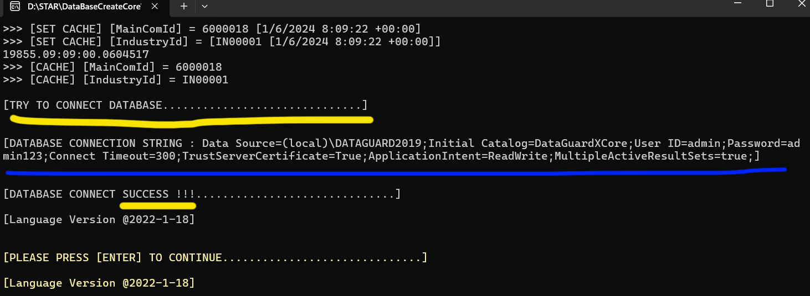
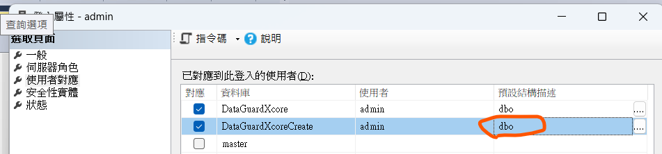
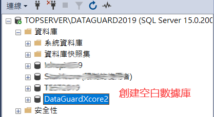
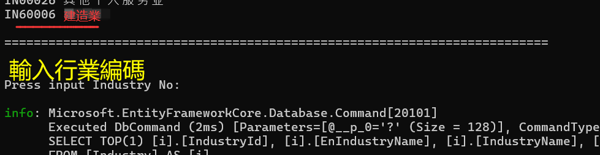
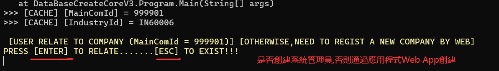
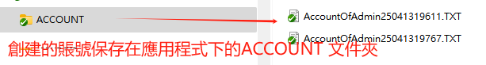
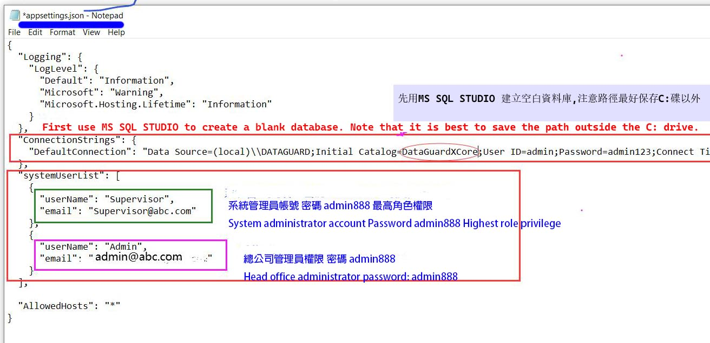
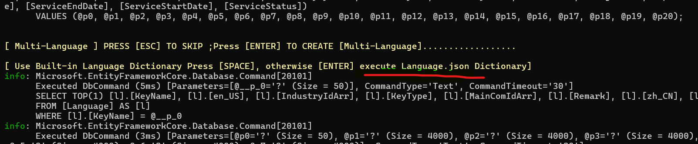
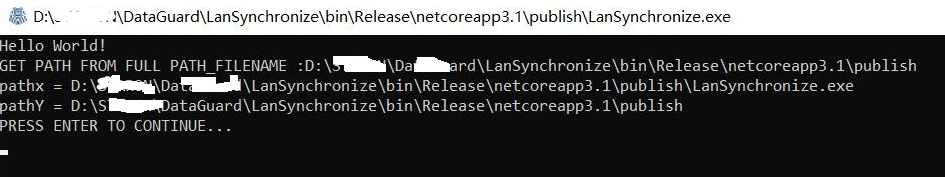
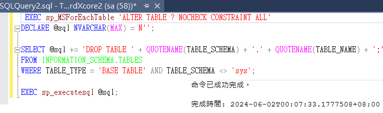

# GDX HRMS 數據庫服務部署

[English Version: README.MD](README.en-US.MD)

##  DataBaseSetupV32 VERSION: V3.2.2025.04 數據庫初始化

舊版本  DataBaseCreateCoreV3_ENHANCE 2024.05

**GDX HRMS  **

DGX Attendance & Salary HRMS**人力資源與薪酬管理系統**  數據庫初始化

## 取消證書授權安裝

資料庫安裝：取消需要使用證書授權安裝。

## 項目目的和作用 

<u>目標:為客戶**初始化部署**, 創建初始化數據庫</u>,

Objective: Initialize deployment for customers and create an initial database.

Download Deploy exe from : 

https://github.com/lawtatfaitony/DataBaseSetupV32

## LICENSE證書安裝

需要版權方授權的證書文件複製到應用程式根目錄下： AppAuth.key 或者系統安裝盤下c:

### 第一步 目標數據庫

必須檢查連接串是否正常鏈接，**特別數據庫是不是空白的目標數據庫**。

```
[DATABASE CONNECTION STRING : Data Source=(local)\DATAGUARD2019;Initial Catalog=DataGuardXCore;User ID=sa;Password=a*1*3;Connect Timeout=300;TrustServerCertificate=True;ApplicationIntent=ReadWrite;MultipleActiveResultSets=true;]
```



安裝秘訣: 注意黃色文字, 按 [ENTER] 是默認操作。

### 第二步 數據庫賬號 admin

MSSQL 2019/2016 SERVER 先創建一個賬號 admin (或者其他名稱), 並且必須設置 架構Scheme = dbo




### 第三步 數據庫存儲路徑

創建一個空白的數據庫,注意指定具體的數據庫存儲路徑 如: D:\DataBase

### 第四步 空白數據與程式設置

檢查賬戶Admin是不是數據庫所有者,即係schema還不是 dbo

##### 	1、設置空白數據庫

​	先在MS SQL 2016/1029//2022 的STUDIO 數據庫管理工具打開鏈接後,



##### 	2、設置連接串 

​	在 文件 中 appsettings.json,設置對應的數據庫連接

##### 	3、配置appsetting.json

​	位於應用程式下的根目錄，用於設置運行相關的數據。

```
    //節點定義創建的用戶
    "systemUserList": [
        {
          "userName": "Supervisor",				//默認的密碼是 admin888
          "email": "Supervisor@abc.com"			//這裡可以改為公司的真實EMAIL
        },
        {
          "userName": "Admin",					//默認的密碼是 admin888
          "email": "Admin@abc.com"				//這裡可以改為公司的真實EMAIL 
        }
   ] 
```

4、檢查操作系統語言

   如果界面出現亂碼，可能原因是：

- CMD沒有設置uft-8編碼顯示.

- 系統沒有支持的語言,建議在系統設置->區域語言->添加英文、簡體、繁體。

## 運行

## 命令方式 

```
$ DataBaseCoreCoreV3 "20211210" , "IN60006"  

//第一个参数是总公司ID,必須少于等于8位的数字。
//第二個參數是行業ID, 行業ID的參考來源 JsonData/Industry.zh-HK.json 或者其他語言版本 或者 行業對照表.csv。
```

## Bat文件方式

或者 通過存入bat文件方式： 參數輸入形式修改參數後運行.bat

先打開 CMD ,然後輸入:  DataBaseCreateCoreV3.bat 

```
DataBaseCreateCoreV3.bat 文件內容如下：

rem PARAMETERS 1: MainComId 2:IndustryId
DataBaseCreateCoreV3 "999901" "IN60006"
```

上述第一個參數書MainComID,第二個是行業參數ID，具體參考文件：**行業對照表.csv**

這樣可以特定生成自定義的MainComID, 

## 開始運行

### 	確認運行提示的信息

​		包括 數據服務鏈接串和Language.Jason的修訂日期

### 	輸入行業編號



### ENTER 確定創建管理員賬戶

按[ENTER] 確認是否創建系統操作賬戶，並且在根目錄下生成txt文件保存系統操作賬戶。




**以下是操作過程中注意的問題：**

------


## 如何還原數據庫

如果創建一個種子數據庫,以便每次部署都用這個數據庫的情況,則需要做一下動作:

第一步:先複製 MDF和LOG 文件,然後附加到本地數據.如果是BAK備份文件,則要選擇還原時候的Option選擇強制OverWrite等等前兩個option都勾選.

第二步:附加數據庫的同時會把來源的數據庫用戶也會複製過來的,此時可以強制刪除,但可以會把本地的數據庫服務器的用戶都刪除掉,則可以先把數據庫當前的admin用戶降級到guest後就可以刪除當前的數據庫用戶而不會導致刪除DB Server 的系統用戶. **目的改變架構schema所有者架空Admin用戶才可以刪除的.**

如: 

```
USE DataGuardXcore;
--DROP USER [admin]; 這樣刪除不行的
ALTER USER [admin] WITH DEFAULT_SCHEMA = guest; 先降級後再刪除 目的改變架構schema所有者
然後
DROP USER [admin];
```

## MainComId總公司ID規則

MainComId总公司ID生成规则与技巧2021年6月28日:  则生成的ID是 210627 

  年度月度日 的数字合并就是公司的ID.

  由于太长的ID不方便,如果同一天安装两个,则会出现ID冲突,解决这个问题 可以通過輸入特定參數安装. 

 輸入預設的總公司ID和對應的行業 

	参数输入形式修改参数后运行.bat
	rem PARAMETERS 1: MainComId 2:IndustryId
	DataBaseCreateCoreV3 "999901" "IN60006"     

## 數據庫用戶角色

數據庫所有者DBO

### 賬號和密碼保存在一個txt文件

  

然後會創建一個txt文件保存對應的賬號和密碼的.

### 系統管理員和總公司賬戶的區別



系統管理員是管理整個系統的最高權限,而總公司賬戶是用於管理總公司下的所有資源,為何稱為[總公司賬戶]:由於以公司為單位下還可以有分公司的. 例如:建築行業裡面: 分多個分公司就是旗下的二判,二判可以是由總公司分撥資源提供系統以管理旗下的員工,當然如果是CLOUD概念下,可以由總公司架構一個雲端系統提供給旗下二判,以二判為獨立公司自我管理公司資源.

The system administrator has the highest authority to manage the entire system, while the head office account is used to manage all resources under the head office. Why is it called the head office account? Because a company can have branches under it. For example, in the construction industry, multiple branches are the sub-contractors under it. The sub-contractors can be provided with resources by the head office to manage their employees. Of course, if it is under the CLOUD concept, the head office can build a cloud system to provide it to the sub-contractors under it, so that the sub-contractors can manage company resources as independent companies.

### 同步語言包Language.json

文件在: 應用程序 JsonData/Language.json 這個文件來自LangMXcore應用程序的 jsonData/下面

默認資源庫在Language.json的配置語言標識



**上述黃色字的兩行都是選擇項，一般情況下都是[ENTER]確定。** Language.json文件數據同步到數據庫的每一條記錄都會慢一點的。運行過程中，可以Sceen Cut (Win+Shift+S),查閱是否異常。

### 執行 SychronizeM 同步語言包

​	執行 SychronizeM.EXE 同步語言包D:\STAR\SychronizeM



## 如果重建一次的操作

如果一旦操作失敗或者其他原因導致要重新一操作一次，可以清空數據庫，而無需重新創建建數據庫。

### 第一步:清空約束或數據

在刪除所有表的前提是要清空約束或數據才能刪除的:

```sql
--若要清空 MSSQL 2019 中所有表的數據，您可以使用以下 T-SQL 語句：
c --執行這句就可以:刪除約束
EXEC sp_MSForEachTable 'DELETE FROM ?' 							--刪除所有數據
EXEC sp_MSForEachTable 'ALTER TABLE ? CHECK CONSTRAINT ALL' 	--恢復約束
```

這些 T-SQL 語句將會逐一對每一個表執行暫時禁用約束、刪除數據、重新啟用約束的操作，從而清空所有表的數據。請謹慎使用這個操作，因為刪除數據後將無法恢復。

### 第二步:刪除由用戶建立的表

在 MSSQL 2019 中，您可以使用以下 T-SQL 語句來刪除所有由用戶建立的表：

```sql
USE [YourDatabaseName];

DECLARE @sql NVARCHAR(MAX) = N'';

SELECT @sql += 'DROP TABLE ' + QUOTENAME(TABLE_SCHEMA) + '.' + QUOTENAME(TABLE_NAME) + ';' 
FROM INFORMATION_SCHEMA.TABLES 
WHERE TABLE_TYPE = 'BASE TABLE' AND TABLE_SCHEMA <> 'sys';

EXEC sp_executesql @sql;
```



請確保將 `[YourDatabaseName]` 替換為您的數據庫名稱。這個 T-SQL 語句將會動態生成一條包含刪除所有用戶建立表格的 SQL 語句，然後執行這些語句來刪除所有用戶建立的表格。請謹慎使用這個操作，因為刪除表格後數據將無法恢復。

快捷: **清除約束和清除用戶表.sql** 這個文件<u>點擊執行多次</u>直到提示完成,就可以切底刪除用戶建立的數據庫表和約束。

## 創建作業備份

### 第一步: 創建 存儲過程

#### SP_BACKUPDB.sql

通過 sqlCMD命令執行 本分作業, 本這個sqlCMD寫成批處理.bat 在Windows 的 [TaskSchedule 任務調度] 設置每日執行此bat文件,實現每日備份.

```
--首先在 MS SQL SERVER 創建 STORE PROCEDURE
USE [DataGuardXcore]
GO
/****** Object:  StoredProcedure [dbo].[SP_BACKUPDB]    Script Date: 15/9/2024 0:11:10 ******/
SET ANSI_NULLS ON
GO
SET QUOTED_IDENTIFIER ON
GO

ALTER PROCEDURE [dbo].[SP_BACKUPDB]
AS
DECLARE @strBackup nvarchar(200)
DECLARE @strBackupIshopX nvarchar(200)
--DECLARE @strToday nvarchar(8)
--DECLARE @strTime nvarchar(8)
--SELECT @strToday = CONVERT(CHAR(8), GETDATE(), 112)
--SELECT @strTime = LEFT(CONVERT(CHAR(8), GETDATE(), 108), 2) + SUBSTRING(CONVERT(CHAR(8), GETDATE(), 108), 4, 2) + RIGHT(CONVERT(CHAR(8), GETDATE(), 108), 2)

DECLARE @str varchar(200)
set @str = replace(replace(replace(CONVERT(varchar, getdate(), 120 ),'-',''),' ',''),':','')
  
SET @strBackup = 'C:\DataBaseBAK\DataGuardXcore_' + @str + '.bak'

BACKUP DATABASE DataGuardXcore
TO DISK= @strBackup
WITH FORMAT

 
```

### 第二步: BAT 命令 執行 sqlCMD 

然後 寫一個 BAT 命令 執行 sqlCMD 命令, 具體的bat文件內容如下:

```
----
```


It is recommended to select outline browsing!

Author:Tony Law 

Email: caihaili82@gmail.com

