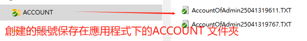
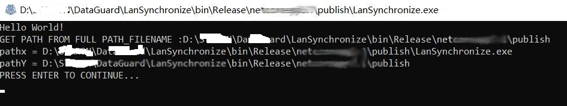
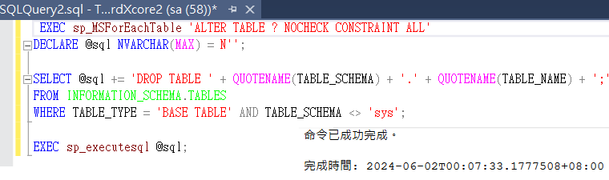

# GDX HRMS Database service deployment 

[繁体版本 README.MD](README.MD)

##  DataBaseSetupV32 VERSION: V3.2.2025.04 Database initialization

Old version  DataBaseCreateCoreV3_ENHANCE 2024.05

**GDX HRMS  **

DGX Attendance & Salary HRMS **Human Resources and Payroll Management System** Database Initialization

## Canceling Certificate Authority Installation

Database installation: Cancel the need to use a certificate authority for installation.

## Project purpose and role

<u>Goal: **Initialize deployment** for customers, create an initial database</u>,

Objective: Initialize deployment for customers and create an initial database.

Download Deploy exe from : 

https://github.com/lawtatfaitony/DataBaseSetupV32

## LICENSE INSTALLATION

The certificate file that needs to be authorized by the copyright holder is copied to the root directory of the application: AppAuth.key or the system installation disk c:

### Step 1 Target Database

You must check whether the connection string is connected normally, **especially whether the database is a blank target database**.

```
[DATABASE CONNECTION STRING : Data Source=(local)\DATAGUARD2019;Initial Catalog=DataGuardXCore;User ID=sa;Password=a*1*3;Connect Timeout=300;TrustServerCertificate=True;ApplicationIntent=ReadWrite;MultipleActiveResultSets=true;]
```


Installation Tip: Note the yellow text, pressing [ENTER] is the default action.

### Step 2 Database account admin

MSSQL 2019/2016 SERVER:  First create an account admin (or other name), and must set the architecture Scheme = dbo


### Step 3 Database storage path

Create a blank database and specify the specific database storage path, such as: D:\DataBase

### Step 4 Blank Data and Program Settings

Check if the Admin account is the database owner, that is, the schema is not dbo

##### 	1、Setting up a blank database

​	First open the link in the STUDIO database management tool of MS SQL 2016/1029//2022,


##### 	2、Set the connection string

​	In the file appsettings.json, set the corresponding database connection

##### 	3、Configure appsetting.json

​	Located in the root directory of the application, it is used to set operation-related data.

```
    //User created by node definition
    "systemUserList": [
        {
          "userName": "Supervisor",				//The default password is admin888
          "email": "Supervisor@abc.com"			//This can be changed to the company's EMAIL
        },
        {
          "userName": "Admin",					//The default password is admin888
          "email": "Admin@abc.com"				//This can be changed to the company's EMAIL
        }
   ] 
```

4、Check the operating system language

   If garbled characters appear on the interface, the possible reasons are:

- CMD does not set UTF-8 encoding display.

- The system does not support the language. It is recommended to add English, Simplified Chinese, and Traditional Chinese in System Settings->Regional Language->.

## Operation

## Command mode 

```
$ DataBaseCoreCoreV3 "20211210" , "IN60006"  

//The first parameter is the parent company ID, which must be less than or equal to 8 digits.
//The second parameter is the industry ID, the reference source of the industry ID JsonData/Industry.zh-HK.json Or other language versions Or 行業對照表.csv。
```

## Bat file method

Or by saving it in a bat file： 參數輸入形式修改參數後運行.bat

Open CMD first, then enter :  DataBaseCreateCoreV3.bat 

```
DataBaseCreateCoreV3.bat The file contents are as follows：

rem PARAMETERS 1: MainComId 2:IndustryId
DataBaseCreateCoreV3 "999901" "IN60006"
```

The first parameter book mentioned above is MainComID, and the second is the industry parameter ID. For specific reference, please refer to the file: **Industry comparison table.csv**

This way, you can generate a customized MainComID.

## Start running

### 	Confirm the information prompted by the operation

​		Includes the data service link string and the revision date of Language.Jason

### 	Enter Industry No.


### ENTER Confirm to create an administrator account

Press [ENTER] to confirm whether to create a system operation account and generate a txt file in the root directory to save the system operation account.


**The following are issues to pay attention to during operation:**

------


## How to restore a database

If you create a seed database so that you can use this database for each deployment, you need to do the following:

Step 1: Copy the MDF and LOG files first, and then attach them to the local data. If it is a BAK backup file, you need to select the option to force OverWrite when restoring, and check the first two options.

Step 2: When attaching the database, the source database user will also be copied. At this time, you can force deletion, but it may delete all the users of the local database server. You can first downgrade the current admin user of the database to guest, and then delete the current database user without deleting the system user of the DB Server. **The purpose is to change the schema owner to override the Admin user before deleting it.**

Such as: 

```
USE DataGuardXcore;
--DROP USER [admin]; This deletion won't work.
ALTER USER [admin] WITH DEFAULT_SCHEMA = guest; Downgrade first and then delete to change the schema owner
THAN:
DROP USER [admin];
```

## MainComId Headquarters ID Rules

MainComId Headquarters ID generation rules and tips June 28, 2021: The generated ID is 210627

The digital combination of the year, month, and day is the company's ID.

Because a long ID is inconvenient, if two are installed on the same day, there will be an ID conflict. To solve this problem, you can install it by entering specific parameters.

Enter the preset headquarter ID and the corresponding industry

	参数输入形式修改参数后运行.bat
	rem PARAMETERS 1: MainComId 2:IndustryId
	DataBaseCreateCoreV3 "999901" "IN60006"     

## Database User Roles

Database Owner DBO

### The account and password are saved in a txt file

  

Then a txt file will be created to save the corresponding account and password.

### The difference between system administrator and head office accounts


系統管理員是管理整個系統的最高權限,而總公司賬戶是用於管理總公司下的所有資源,為何稱為[總公司賬戶]:由於以公司為單位下還可以有分公司的. 例如:建築行業裡面: 分多個分公司就是旗下的二判,二判可以是由總公司分撥資源提供系統以管理旗下的員工,當然如果是CLOUD概念下,可以由總公司架構一個雲端系統提供給旗下二判,以二判為獨立公司自我管理公司資源.

The system administrator has the highest authority to manage the entire system, while the head office account is used to manage all resources under the head office. Why is it called the head office account? Because a company can have branches under it. For example, in the construction industry, multiple branches are the sub-contractors under it. The sub-contractors can be provided with resources by the head office to manage their employees. Of course, if it is under the CLOUD concept, the head office can build a cloud system to provide it to the sub-contractors under it, so that the sub-contractors can manage company resources as independent companies.

### Synchronous language packs: Language.json

File in: Application JsonData/Language.json This file comes from LangMXcore application's jsonData/

Default resource library in Language.json configuration language identifier


**The two yellow lines above are options. Generally, press [ENTER] to confirm. ** The synchronization of the Language.json file data to each record in the database will be slower. During the operation, you can press Scene Cut (Win+Shift+S) to check if there is any abnormality.

### Execute SychronizeM to synchronize the language package

​	Execute SychronizeM.EXE to synchronize the language pack D:\STAR\SychronizeM



## If you rebuild once

If an operation fails or needs to be repeated for other reasons, you can clear the database instead of recreating it.

### Step 1: Clear constraints or data

The premise of deleting all tables is to clear constraints or data:

```sql
--To clear data from all tables in MSSQL 2019, you can use the following T-SQL statement:
c --Execute this sentence to delete the constraint:
EXEC sp_MSForEachTable 'DELETE FROM ?' 							--Delete all data
EXEC sp_MSForEachTable 'ALTER TABLE ? CHECK CONSTRAINT ALL' 	--Restore Constraints
```

These T-SQL statements will temporarily disable constraints, delete data, and re-enable constraints for each table one by one, thereby clearing the data of all tables. Please use this operation with caution, because the deleted data cannot be recovered.

### Step 2: Delete the table created by the user

In MSSQL 2019, you can use the following T-SQL statement to delete all user-created tables:

```sql
USE [YourDatabaseName];

DECLARE @sql NVARCHAR(MAX) = N'';

SELECT @sql += 'DROP TABLE ' + QUOTENAME(TABLE_SCHEMA) + '.' + QUOTENAME(TABLE_NAME) + ';' 
FROM INFORMATION_SCHEMA.TABLES 
WHERE TABLE_TYPE = 'BASE TABLE' AND TABLE_SCHEMA <> 'sys';

EXEC sp_executesql @sql;
```



Please make sure to replace `[YourDatabaseName]` with your database name. This T-SQL statement will dynamically generate a SQL statement containing the deletion of all user-created tables, and then execute these statements to delete all user-created tables. Please use this operation with caution, because the data will not be recovered after deleting the table.

Quick: **Clear Constraints and Clear User Tables.sql** This file <u>Click Execute multiple times</u> until the prompt is completed, and you can completely delete the database tables and constraints created by the user.

## Creating a Job Backup

### Step 1: Create a stored procedure

#### SP_BACKUPDB.sql

Execute this task through sqlCMD command. This sqlCMD is written as a batch file. Bat file is set to execute this bat file daily in Windows [TaskSchedule] to achieve daily backup.

```
--首先在 MS SQL SERVER 創建 STORE PROCEDURE
USE [DataGuardXcore]
GO
/****** Object:  StoredProcedure [dbo].[SP_BACKUPDB]    Script Date: 15/9/2024 0:11:10 ******/
SET ANSI_NULLS ON
GO
SET QUOTED_IDENTIFIER ON
GO

ALTER PROCEDURE [dbo].[SP_BACKUPDB]
AS
DECLARE @strBackup nvarchar(200)
DECLARE @strBackupIshopX nvarchar(200)
--DECLARE @strToday nvarchar(8)
--DECLARE @strTime nvarchar(8)
--SELECT @strToday = CONVERT(CHAR(8), GETDATE(), 112)
--SELECT @strTime = LEFT(CONVERT(CHAR(8), GETDATE(), 108), 2) + SUBSTRING(CONVERT(CHAR(8), GETDATE(), 108), 4, 2) + RIGHT(CONVERT(CHAR(8), GETDATE(), 108), 2)

DECLARE @str varchar(200)
set @str = replace(replace(replace(CONVERT(varchar, getdate(), 120 ),'-',''),' ',''),':','')
  
SET @strBackup = 'C:\DataBaseBAK\DataGuardXcore_' + @str + '.bak'

BACKUP DATABASE DataGuardXcore
TO DISK= @strBackup
WITH FORMAT

 
```

### Step 2: BAT command executes sqlCMD

Then write a BAT command to execute the sqlCMD command. The specific bat file content is as follows:

```
----
```


It is recommended to select outline browsing!

Author:Tony Law 

Email: caihaili82@gmail.com

